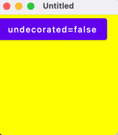

**Desktop**
- `./gradlew run` - run application

```Kotlin
fun main() = application {
    var undecorated by remember { mutableStateOf(true) }
    key(undecorated) {
        Window(
            onCloseRequest = ::exitApplication,
            state = rememberWindowState(width = Dp.Unspecified, height = Dp.Unspecified),
            undecorated = undecorated,
            resizable = true,
        ) {
            WindowDraggableArea {
                Box(Modifier.size(200.dp).background(Color.Yellow)) {
                    Button(onClick = { undecorated = !undecorated }) {
                        Text("undecorated=$undecorated")
                    }
                }
            }
        }
    }
}
```

### With undecorated = false


### With undecorated = true

